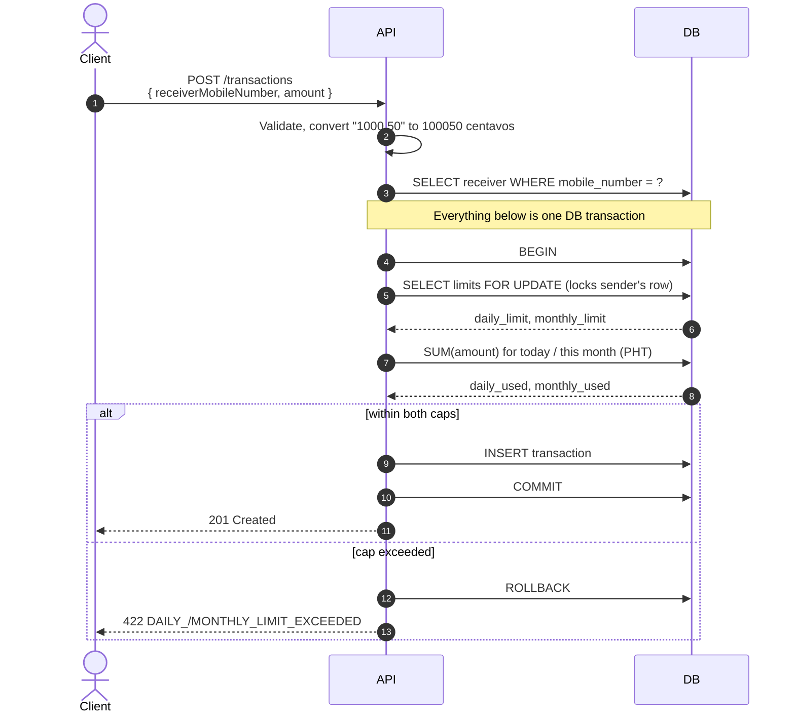

# Application Flow

End-to-end walkthrough of the Send Money Limits module, with copy-pasteable requests.

## Conventions

**Base URL.** `http://localhost:3001` when using the values from `.env.example`. If you changed `APP_HOST_PORT`, substitute accordingly.

**Auth.** `POST /auth/login` sets an httpOnly cookie holding a signed JWT. That cookie is what identifies the user on `/transactions/*`; no other credential is needed.

**Money.** Amounts are sent as decimal strings (or numbers) with at most 2 decimal places, for example `"1000.50"`. Responses always return decimal strings alongside an explicit `"currency": "PHP"`. Internally everything is stored as integer centavos, so no floating-point rounding is possible.

**Mobile numbers.** Any common Philippine format is accepted on input: `09171234567`, `+639171234567`, `639171234567`, `9171234567`, with or without spaces, dashes and parentheses. They are normalized to E.164 (`639XXXXXXXXX`) for storage and in responses.

**Time.** All daily and monthly boundaries are evaluated in **Asia/Manila (PHT)**, computed explicitly in SQL so results never depend on server or session timezone configuration.

---

## Seeded accounts

The database is migrated and seeded automatically on `docker compose up`. There is no registration endpoint, so these are the only accounts.

| Name | Mobile number | mPIN | Daily limit | Monthly limit |
|---|---|---|---|---|
| Alice Santos | `09000000001` | `1111` | ₱50,000.00 | ₱500,000.00 |
| Bob Reyes | `09000000002` | `2222` | ₱50,000.00 | ₱500,000.00 |
| Carol Cruz | `09000000003` | `3333` | ₱50,000.00 | ₱500,000.00 |
| Dave Lim | `09000000004` | `4444` | ₱50,000.00 | ₱500,000.00 |

To re-seed at any time:

```bash
docker compose exec app npm run db:seed
```

---

## 1. Authenticate

When no user matches, the service still runs a verification against a dummy hash before responding. This keeps the response time for an unknown mobile number indistinguishable from a wrong mPIN, so the endpoint cannot be used to enumerate which numbers are registered.

**Request**

```bash
curl -X POST http://localhost:3001/auth/login \
  -H "Content-Type: application/json" \
  -c cookies.txt \
  -d '{ "mobileNumber": "09000000001", "mpin": "1111" }'
```

**Response:** `200 OK`

```json
{
  "data": {
    "id": "01a03d2d-2e25-7dc7-a6ba-f6b3ba036dd8",
    "name": "Alice Santos",
    "mobileNumber": "639000000001"
  }
}
```

The access token is returned as an `httpOnly` cookie rather than in the body, so browser-side JavaScript cannot read it. `-c cookies.txt` stores it for the subsequent requests; Swagger UI and browsers handle this automatically.

**Failure cases**

| Condition | Status | Code |
|---|---|---|
| Malformed mobile number or mPIN | 400 | `VALIDATION_ERROR` |
| Unknown number or wrong mPIN | 401 | `INVALID_CREDENTIALS` |

---

## 2. Check your limits

Reports the caps, what has been used in the current PHT day and month, and what remains.

```bash
curl http://localhost:3001/transactions/usage -b cookies.txt
```

**Response:** `200 OK`

```json
{
  "currency": "PHP",
  "daily":   { "limit": "50000.00",  "used": "100.50", "remaining": "49899.50" },
  "monthly": { "limit": "500000.00", "used": "100.50", "remaining": "499899.50" }
}
```

Usage is **computed from the transaction ledger on every request**, summed over the current PHT day and month, rather than stored as a decrementing counter. Nothing resets at midnight; the date filter simply shifts, so usage can never drift out of sync with the recorded transactions.

---

## 3. Send money



The sender's `transfer_limits` row is locked with `SELECT ... FOR UPDATE` **before** usage is summed. Two simultaneous sends from the same user therefore serialize: the second blocks until the first commits, then recomputes usage against the updated ledger. Without the lock both could read the same stale total and each pass a check the pair collectively violates. Different senders never contend, since they lock different rows.

**Request**

```bash
curl -X POST http://localhost:3001/transactions \
  -H "Content-Type: application/json" \
  -b cookies.txt \
  -d '{ "receiverMobileNumber": "09000000002", "amount": "1000.50" }'
```

The sender is always taken from the authenticated session, never from the request body, so a caller cannot send money as another user.

**Response:** `201 Created`

```json
{
  "id": "01a03d2d-e830-7ee1-a206-c646a66fb766",
  "senderId": "01a03d2d-2e25-7dc7-a6ba-f6b3ba036dd8",
  "receiverId": "01a03d2d-2e41-739f-9306-e0ef0171ad5a",
  "amount": "1000.50",
  "currency": "PHP",
  "createdAt": "2026-08-26T08:26:53.862Z"
}
```

**Failure cases**

| Condition | Status | Code |
|---|---|---|
| No or expired session cookie | 401 | `UNAUTHORIZED` |
| Amount ≤ 0, more than 2 decimals, or malformed number | 400 | `VALIDATION_ERROR` |
| Receiver does not exist | 400 | `INVALID_RECEIVER` |
| Receiver is the sender | 400 | `INVALID_REQUEST` |
| Would exceed the daily cap | 422 | `DAILY_LIMIT_EXCEEDED` |
| Would exceed the monthly cap | 422 | `MONTHLY_LIMIT_EXCEEDED` |
| Sender has no limits configured | 422 | `UNPROCESSABLE` |

### Limits are inclusive

A transfer is allowed when it does **not exceed** the remaining limit, so a send landing exactly on the boundary succeeds.

```bash
# With ₱49,899.50 remaining today:
curl -X POST http://localhost:3001/transactions -b cookies.txt \
  -H "Content-Type: application/json" \
  -d '{ "receiverMobileNumber": "09000000002", "amount": "49899.50" }'
# → 201 Created. Remaining is now exactly 0.00

curl -X POST http://localhost:3001/transactions -b cookies.txt \
  -H "Content-Type: application/json" \
  -d '{ "receiverMobileNumber": "09000000002", "amount": "0.01" }'
# → 422 DAILY_LIMIT_EXCEEDED
```

---

## 4. View transaction history

Returns transfers where the authenticated user is the sender or the receiver, newest first.

```bash
curl "http://localhost:3001/transactions?direction=outbound&limit=20&offset=0" -b cookies.txt
```

**Query parameters**

| Parameter | Values | Default | Meaning |
|---|---|---|---|
| `direction` | `outbound` \| `inbound` | both | Money sent / money received |
| `limit` | 1–100 | 20 | Page size |
| `offset` | ≥ 0 | 0 | Rows to skip |

**Response:** `200 OK`

```json
{
  "data": [
    {
      "id": "01a03d2d-e830-7ee1-a206-c646a66fb766",
      "senderId": "01a03d2d-2e25-7dc7-a6ba-f6b3ba036dd8",
      "receiverId": "01a03d2d-2e41-739f-9306-e0ef0171ad5a",
      "amount": "1000.50",
      "currency": "PHP",
      "createdAt": "2026-08-26T08:26:53.862Z"
    }
  ],
  "pagination": { "hasMore": false }
}
```

`hasMore` is derived by requesting one row beyond `limit` and discarding it, so the client learns whether another page exists without a second query or a full `COUNT`.

---

## 5. Log out

```bash
curl -X POST http://localhost:3001/auth/logout -b cookies.txt
```

**Response:** `204 No Content`

This clears the session cookie. Because access tokens are stateless, a token captured before logout stays valid until it expires; see the production notes in the main README.

---

## Error reference

Every error shares one shape:

```json
{ "code": "DAILY_LIMIT_EXCEEDED", "message": "..." }
```

| Code | Status | Meaning |
|---|---|---|
| `VALIDATION_ERROR` | 400 | Request body or query failed schema validation |
| `INVALID_RECEIVER` | 400 | No user with that mobile number |
| `INVALID_REQUEST` | 400 | Self-transfers are not allowed |
| `UNAUTHORIZED` | 401 | Missing or expired session cookie |
| `INVALID_CREDENTIALS` | 401 | Mobile number or mPIN is incorrect |
| `NOT_FOUND` | 404 | No such route |
| `DAILY_LIMIT_EXCEEDED` | 422 | Transfer would exceed the daily cap |
| `MONTHLY_LIMIT_EXCEEDED` | 422 | Transfer would exceed the monthly cap |
| `UNPROCESSABLE` | 422 | No transfer limits configured for the account |

`422` is used for requests that are well-formed and authorized but blocked by a business rule, keeping them distinguishable from malformed input (`400`).

